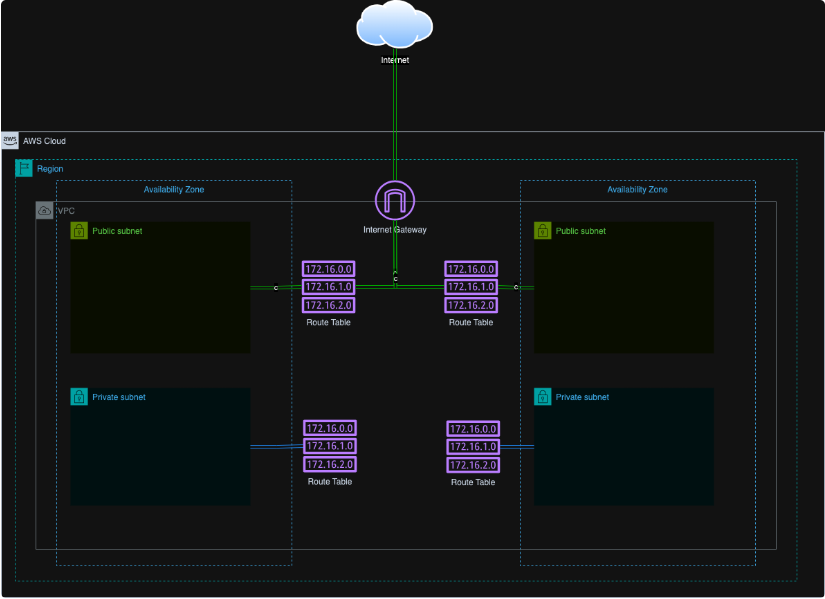
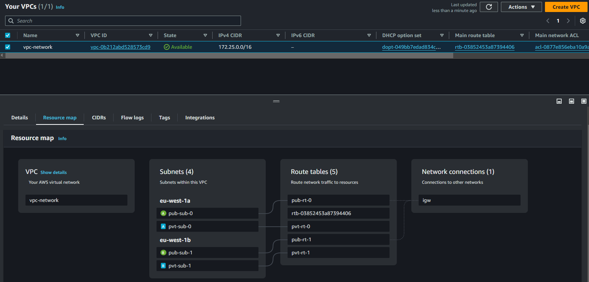
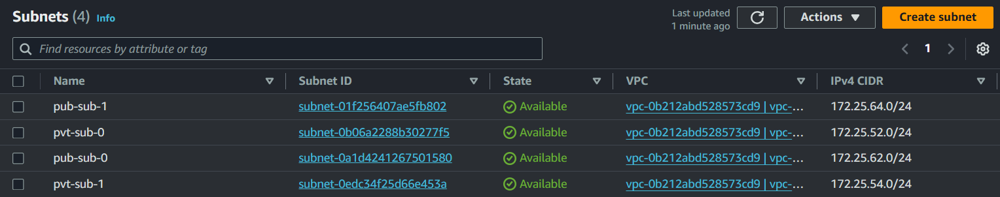
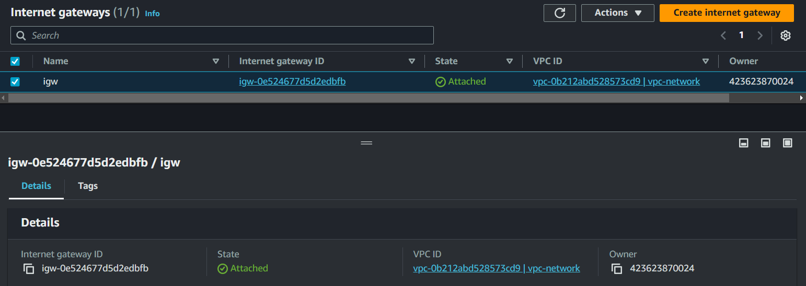
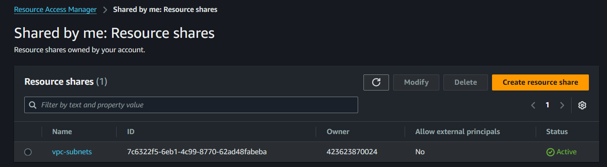
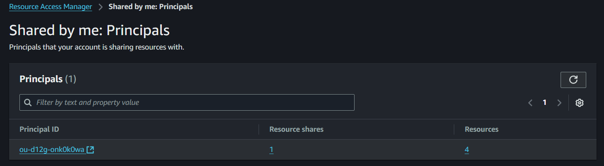

**Terraform Code to create a VPC resource**

The AWS account where this script will run is created based on the [AWS Security Reference Architecture](https://docs.aws.amazon.com/prescriptive-guidance/latest/security-reference-architecture/network.html)

A Network account is defined to host networking resources. Using the AWS resource access manager managed service, the resources are shared across other AWS accounts in a [multi-account environment](https://docs.aws.amazon.com/prescriptive-guidance/latest/migration-aws-environment/building-landing-zones.html#aws-control-tower)

The Terraform script creates a VPC resource with four subnets, two public and two private, corresponding route tables, and an internet gateway associated with the public subnets.

Here is a diagram of the VPC we want to build:

**Region: eu-west-1**

***VPC***

***Subnets***

***Route Tables***

***Internet Gateway***

***Resource Access Manager***

***Resource Share***

Resource sharing has already been enabled at the organisational level.

***Principal***

